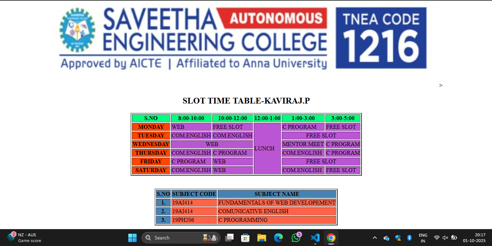

# Ex03 Time Table
# Date:22\09\2025
# AIM
To write a html webpage page to display your slot timetable.

# ALGORITHM
## STEP 1
Create a Django-admin Interface.

## STEP 2
Create a static folder and inert HTML code.

## STEP 3
Create a simple table using `<table>` tag in html.

## STEP 4
Add header row using `<th>` tag.

## STEP 5
Add your timetable using `<td>` tag.

## STEP 6
Execute the program using runserver command.

# PROGRAM
```
<html>
    <head>
        <center>
        >
<h2>SLOT TIME TABLE-KAVIRAJ.P</h2>
    </head>
    <body>
        <table border="2" >
            <tr style="background-color: springgreen;">
                <th>S.NO</th> 
                <th>8:00-10:00</th>
                <th>10:00-12:00</th>
                <th>12:00-1:00</th>
                <th>1:00-3:00</th>
                <th>3:00-5:00</th>
            </tr>
            <tr style="background-color: mediumorchid;">
                <th style="background-color: orangered;">MONDAY</th>
                <td>WEB</td>
                <td>FREE SLOT</td>
                <td rowspan="6">LUNCH</td>
                <td>C PROGRAM</td>
                <td>FREE SLOT</td>
            </tr>
            <tr style="background-color: mediumorchid;">
                <th style="background-color: orangered;">TUESDAY</th>
                <td>COM.ENGLISH</td>
                <td>COM.ENGLISH</td>
                <td colspan="2" style="text-align: center;">FREE SLOT</td>
            </tr>
            <tr style="background-color: mediumorchid;">
                <th style="background-color: orangered;">WEDNESDAY</th>
                <td colspan="2" style="text-align: center;">WEB</td>
                <td>MENTOR MEET</td>
                <td>C PROGRAM</td>
            </tr>
            <tr style="background-color: mediumorchid;">
                <th style="background-color: orangered;">THURSDAY</th>
                <td>COM.ENGLISH</td>
                <td>C PROGRAM</td>
                <td>COM.ENGLISH</td>
                <td>C PROGRAM</td>
            </tr>
            <tr style="background-color: mediumorchid;">
                <th style="background-color: orangered;">FRIDAY</th>
                <td>C PROGRAM</td>
                <td>WEB</td>
                <td colspan="2" style="text-align: center;">FREE SLOT</td>
             </tr>
            <tr style="background-color: mediumorchid;">
                <th style="background-color: orangered;">SATURDAY</th>
                <td>COM.ENGLISH</td>
                <td>WEB</td>
                <td>COM.ENGLISH</td>
                <td>FREE SLOT</td>
            </tr>
        </table>
        <br>
        <br>
        <table border="2">
            <tr style="background-color: steelblue;">
                <th>S.NO</th>
                <th>SUBJECT CODE</th>
                <th>SUBJECT NAME</th>
            </tr>
            <tr style="background-color: tomato;">
                <th style="background-color: steelblue;">1.</th>
                <td>19AI414</td>
                <td>FUNDAMENTALS OF WEB DEVELOPEMENT</td>
            </tr>
            <tr style="background-color: tomato;">
                <th style="background-color: steelblue;">2.</th>
                <td>19AI414</td>
                <td>COMUNICATIVE ENGLISH</td>
            </tr>
            <tr style="background-color: tomato;">
                <th style="background-color: steelblue;">3.</th>
                <td>19PH206</td>
                <td>C PROGRAMMING</td>
            </tr>
        </table>

    </body>
</html>
```
# OUTPUT

# RESULT
The program for creating slot timetable using basic HTML tags is executed successfully.
